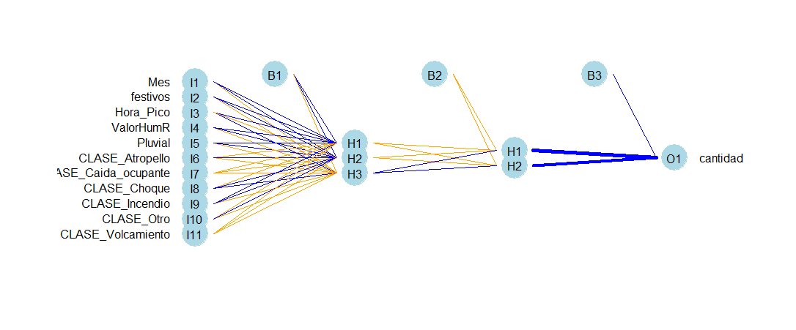
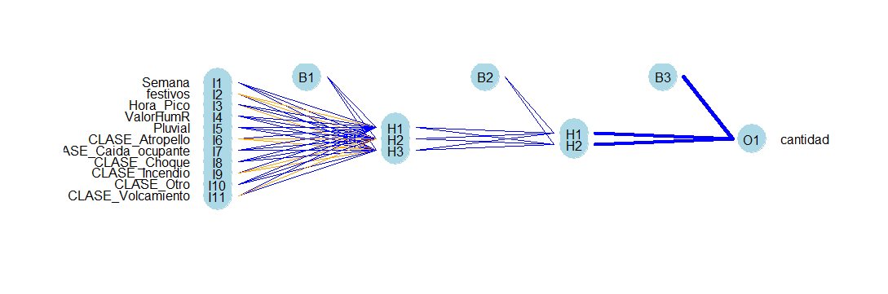
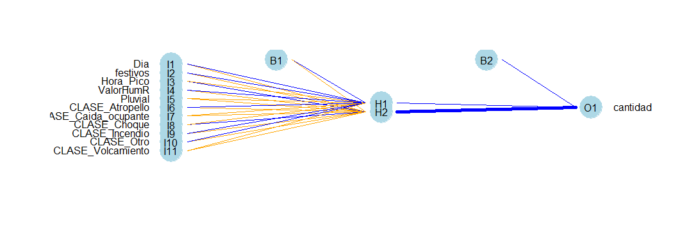

```{r setup, include=FALSE}
knitr::opts_chunk$set(echo = T)
knitr::opts_chunk$set(warning = F)
knitr::opts_chunk$set(message = F)
```
<center> <h3> Resumen </h3> </center>
<p align = "justify"> La accidentalidad vial es un fenómeno que se está convirtiendo en un problema de salud pública dado que toca directamente al ser humano y detrás de cada cifra hay un drama familiar, por esta razón las entidades gubernamentales tienen que ser más ambiciosos en materia de campañas, entendiendo que hay una gran inversión desde el orden nacional para resolver esta problemática, pero no es suficiente, por lo cual se debe insistir más en el tema de seguridad vial desde lo local. Al respecto, la alcaldía de Medellín a venido recolectando datos sobre accidentalidad vehicular en el municipio desde el año 2014 con el fin de describir el comportamiento y los lugares más afectados por este problema. En este trabajo se utiliza información de accidentes de 2014 a 2018 para describir estadisticamente los accidentes presentados y tratar de predecir accidentes presentados en las diferentes epocas del año y sitios del municipio. </p>

<h1> 1. Introducción </h1>
<p align = "justify">La Estadística se ocupa del manejo de la información que pueda ser cuantificada. Implica esto la descripción de conjuntos de datos y la inferencia a partir de la información recolectada de un fenómeno de interés. La función principal de la estadística abarca: Resumir, Simplificar, Comparar, Relacionar, Proyectar. Constantemente se generan datos que se alojan en los sistemas de información y bases de datos públicas y privadas. La Alcaldía de Medellín cuenta con una página web donde alojan bases de datos públicas en diferentes temas sobre la ciudad. El objetivo de este trabajo es utilizar la Estadística y el desarrollo computacional para analizar los datos de incidentes georreferenciados de 2014 a 2018 de la ciudad de Medellín para predecir accidentes del año 2019 con el fin de descubrir factores que se relacionan con los accidentes y ayudar de alguna manera a las entidades públicas a tomar decisiones en temas de seguridad vial.</p>

<h3> Documentación Soporte </h3>
* En el enlace se encuentra alojado el aplicativo web *VehApp* que permite visualizar la accidentalidad y pronosticar [Enlace: Aplicacion web VehApp](https://samuel-agudelo-gamboa.shinyapps.io/VEHAPP/_w_c05ae4e5/)

* En el enlace se encuentra alojado el *Github* principal que contiene todos los archivos y scripts utilizados para la construcción e implementación de este trabajo [Enlace: Github principal](https://github.com/saagudeloga/Accidentalidad-Medellin)

<h1> 2. Metodología </h2>
<p align = "justify"> En inteligencia artificial un problema se define como la existencia de discrepancias entre un estado actual y un estado objetivo. La resolución recurrente y especializada de ciertos tipos de problemas permite identificarlos en forma de tareas. Para abordar este problema se usa la metodología para la Analítica de datos (ASUM-DM) ya que establece una forma probada para llevar un problema a una solución de analítica. ASUM-DM de IBM se basa en la metodología CRISP-DM y hace enfasis en las nuevas prácticas en la ciencia de datos como el uso de volumenes de datos muy grandes, la incorporación de análisis de texto, en el modelado predictivo y la automatización de algunos procesos. El ciclo de elaboración se basa en 9 principales pasos:</p>
<ol>
<li>Entendimiento del negocio</li>
<li>Descubrimiento y Entendimiento de datos</li>
<li>Preparación y gestión de datos</li>
<li>Validación de datos</li>
<li>Análisis</li>
<li>Prototipo</li>
<li>Validación y evaluación</li>
<li>Nueva adquisición de datos</li>
<li>Ciclo de publicación</li>
</ol>

<h1>3. Desarrollo </h1>
<h3>3.1 Entendimiento del negocio </h3>
<p align = "justify"> Más de un millón de personas muere cada año en accidentes automovilísticos,  Estos incidentes ocurren por una cantidad de razones, pero el error humano está en el centro. Los conductores manejan más rápido de lo que deberían en ciertas condiciones atmosféricas, toman decisiones equivocadas y no logran anticipar riesgos potenciales. El conocimiento de las variables involucradas en los accidentes de tránsito pueden facilitar la formulación de políticas específicas para reducir la creciente accidentalidad vial. Asi, el objetivo de este trabajo es describir las características de tiempo, lugar, vehiculo y demás variables que puedan inferir en los accidentes de tránsito de la ciudad de Medellín entre 2014 y 2018, buscando aportar elementos al conocimiento de este problema que sean útiles para quienes allí formulan las políticas de prevención y control de morbilidad y mortalidad.</p>

<h3>3.2 Descubrimiento y entendimiento de datos </h3>
<p align = "justify"> La Alcaldía de Medellín en el portal GeoMedellín suministra las bases de datos anuales para incidentes de tránsito registrados por la Secretaria de Movilidad. Los datos se encuentran en [este enlace.](https://geomedellin-m-medellin.opendata.arcgis.com/search?tags=movilidad). Para el entendimiento del conjunto de datos se define el accidente de transito como: "evento, generalmente involuntario, generado al menos por un vehiculo en movimiento, que causa daños a personas y bienes involucrados en él e igualmente afecta la normal circulación de los vehiculos que se movilizan por la via o vias comprendidas en el lugar o dentro de la zona de influencia del hecho" </p>

La estructura de las variables que contiene los datos es la siguiente:

<center>
|**Variable**|**Descripción**|**Tipo**|**Detalle**|
|:----------:|-------------|:------:|---------|
|X|Coordenada X (longitud) de la ubicación del accidente|float|-|
|Y|Coordenada Y (latitud) de la ubicación del accidente)|float|-|
|OBJECTID|Identificación del registro|integer|-|
|RADICADO|Identificación única del accidente ante la Secretaría de Movilidad|string|-|
|FECHA|Fecha de la ocurrencia del accidente|string|-|
|HORA|Hora aproximada del accidente|datetime|-|
|DIA|Número día dentro del mes del accidente|integer|-|
|PERIODO|Año de la ocurrencia del accidente|integer|-|
|CLASE|Tipo de accidente|String|Clases: atropello, caída del ocupante, choque, incendio, volcamiento, otro|
|DIRECCION|Dirección detallada de la ubicación del accidente|String|-|
|DIRECCION_ENC|Dirección encasillada de la ubicación del accidente|string|Formato único de direcciones de la Alcaldía de Medellín|
|CBML|Identificación única del lote más cercano a la ubicación del accidente|string|Acrónimo de comuna, barrio, manzana, lote|
|TIPO_GEOCOD|Tipo de ubicación catastral|string|Formato de la oficina de catastro de la Alcaldía de Medellín|
|GRAVEDAD|Gravedad del accidente|string|Clases: herido, muerto, solo daños|
|BARRIO|Barrio donde ocurrió el accidente|string|340 niveles dentro de la variable|
|COMUNA|Comuna donde ocurrió el accidente|string|85 niveles dentro de la variable|
|DISENO|Tipo de diseño en donde ocurrió el accidente|string|Clases: ciclo ruta, glorieta, intersección, lote o predio, paso a nivel, paso elevado, paso inferior, pontón, puente, tramo de vía, túnel, vía peatonal|
|DIA_NOMBRE|Nombre del día de la semana del accidente|string|-|
|MES|Número de mes dentro del año del accidente|integer|-|
|MES_NOMBRE|Nombre del mes del accidente|string|-|
|X_MAGNAMED|-|-|-|
|Y_MAGNAMED|-|-|-|
|LONGITUD|Coordenada longitud de la ubicación del accidente|float|-|
|LATITUD|Coordenada latitud de la ubicación del accidente|float|-|
</center>

<h3>3.3 Preparación y gestión de datos </h3>
<p align = "justify"> El conjunto de datos llamado `medellin` cuenta con 228.693 registros y 24 variables que corresponden a accidentes desde el 2014 a 2018. Para el inicio de la preparación de ellos se analizará que variables no hay necesidad de tener en cuenta, cuantas variables hay que transformar y que otras se pueden agregar. Para esto se hace uso de `Tidyverse` en el lenguaje R para la limpieza de datos y otros paquetes necesarios.</p>

<p align = "justify">Desde el portal de *GeoMedellín* se descargan datos de accidentalidad por año desde 2014 a 2018 en archivos csv, se ingresan a una carpeta del computador y se hace lectura de cada uno de ellos luego se juntan para crear solo un conjunto de datos que abarca los 5 años.</p>

```{r}
# Cargar libreria
library(data.table);library(purrr);library(dplyr)        
library(plotly);library(tidyr);library(stringr)      
library(lubridate);library(sf);library(knitr);library(kableExtra)

## lectura de datos

# lista archivos
setwd("Datos")
archivos_datos <- list.files(pattern = ".csv", include.dirs = T, recursive = F)

# lectura de los archivos (2014 a 2018)
datos <- map(archivos_datos, fread, sep = ",", encoding = "UTF-8", colClasses = "c")

# juntar por filas para crear un solo conjunto de datos
medellin <- bind_rows(datos)

# ver datos
kable(head(medellin), align = "ccccc") %>%
  kable_styling() %>%
  scroll_box(width = "100%", height = "300px")
```

Con la descripción de las variables que contienen los datos se identifica las siguientes correcciones que se deben hacer a los datos:

* Convertir la `FECHA` en formato YYYY-MM-DD  

* Eliminar datos vacios en la variable `CLASE`, quitar tildes y unificar nombres de niveles  

* Los datos vacios en la variable `DISENO` se cambian por OTRO, quitar tildes y unificar nombres de niveles  

* Quitar tildes a nombres de dias

```{r}
# Organizar fecha
medellin$FECHA <- as.Date(medellin$FECHA) # Formato YYYY-MM-DD

# Eliminar datos vacios de la variable CLASE y correccion de niveles
medellin <- medellin[-which(medellin$CLASE == ""),]

# Correccion tildes
medellin$CLASE <- iconv(medellin$CLASE, from = "UTF-8", to = "ASCII//TRANSLIT")

# Quitar "DE" (nivel "Caída de ocupante" variable CLASE)
medellin$CLASE <- gsub(pattern = "Caida de Ocupante", replacement = "Caida Ocupante", x = medellin$CLASE) 

#Cambiar nivel vacio por otro en variable DISENO
medellin$DISENO <- ifelse(medellin$DISENO == "","Otro",medellin$DISENO) 

# Quitar tildes en niveles de la variable DISENO
medellin$DISENO <- iconv(medellin$DISENO, from = "UTF-8",to="ASCII//TRANSLIT") #Quitar tildes

# Quitar tildes a nombres de dias en variable DIA
medellin$DIA_NOMBRE <- iconv(medellin$DIA_NOMBRE, from = "UTF-8", to = "ASCII//TRANSLIT")

# ver estructura variables
str(medellin)
```

<h5>**Variables BARRIO y COMUNA**</h5>
<p align = "justify"> La variable barrio y comuna es muy importante para el objetivo, por eso se hace un análisis completo de como están estructurados sus niveles y las reformas que se le deben hacer. Se encontró que la variable `COMUNA` tiene nombres erroneos y además contiene 19.736 registros vacios. En la variable `BARRIO` se tienen 19.766 registros vacios y algunos de sus niveles contienen numeros que no indican bien el nombre de la ubicación. Para la solución de este problema se usó la variable `CBML` que es una identificación única del lote más cercano al accidente conformado por un Acrónimo de comuna, barrio, manzana, lote, con esta variable se puede extraer un registro con los 4 primeros números para obtener la comuna y el barrio. La oficina de catastro cuenta con un shapefile donde se registran verdaderamente los nombres de barrios y comunas identificados con su codigo que en los datos de accidentes serían esos 4 primeros digitos del `CBML`, así que se hace un cruce entre los datos de accidentes y los datos de catastro uniendo por el código. Como observación la variable `CBML` cuenta con 19.757 datos vacios y 185 registros en los cuales no cuenta con un registro `CBML` claro, que ayude a identificar el barrio y la comuna. 

Después de tener organizados barrios y comunas, se eliminan las variables que no son necesarias como `LATITUD` Y `LONGITUD` dado que `X` y `Y` representan lo mismo, `RADICADO`, `CBML`, `TIPO GEOCOD`, `X_MAGNAMED`, `Y_MAGNAMED`, `DIRECCION`, `DIRECCION_ENC` y `MES_NOMBRE` también se eliminan y se realiza un ajuste en el nombre de las variables. El nuevo conjunto de datos queda compuesto de 208.745 registros y 15 variables</p>

```{r}
#==========================
# ARREGLOS COMUNA Y BARRIO
#===========================
setwd("Datos")
catastro <- read_sf("Limite_Barrio_Vereda_Catastral.shp")

# Crear un codigo desde CBML que deje solo comuna y barrio
medellin <- mutate(medellin, CB = str_sub(CBML,1,4))

# ingresar las varaibles de identificacion de lugar dadas por catastro en el archivo de datos
medellin <- inner_join(medellin, select(catastro, CODIGO, NOMBRE_COM, NOMBRE_BAR),
                        by = c("CB" = "CODIGO"))

# Quitar duplicados por el inner_join. Pasamos de 228687 registros a 208745 registros
medellin <- medellin[!duplicated(medellin[,c("OBJECTID")])]

# Quitar tildes y volver a mayuscula los nombres de barrios
medellin$NOMBRE_BAR <- iconv(toupper(medellin$NOMBRE_BAR), from = "UTF-8", to = "ASCII//TRANSLIT")

# Elegimos las columnas que necesarias
medellin <- medellin[,c("X","Y","OBJECTID","FECHA","HORA","DIA","PERIODO","CLASE","GRAVEDAD",
                        "DISENO","DIA_NOMBRE","MES","CB","NOMBRE_COM","NOMBRE_BAR")]

# Cambiemos algunos nombres de las variables
names(medellin)[c(1,2,14,15)] <- c("LONGITUD","LATITUD","COMUNA","BARRIO")

# Asi quedan los datos
head(medellin)
```

<h5>**Nuevas variables**</h5>
<p align = "justify"> En las nuevas variables a ingresar se considera días especiales que corresponden a fechas que se caracterizan por ser grandes eventos en los que la comunidad participa de manera completa o mayoritaria y que de alguna manera afecta la movilidad, para esto se crea un archivo plano csv que tiene el registro de cuales han sido fechas especiales desde 2014 a 2018 y el tipo de festividad, para esta variable se tuvo en cuenta las siguientes fechas especiales.</p>

* BRUJOS: 31-oct día Halloween
* FESTIVO: Días festivos colombianos
* MADRE: Día de la Madre
* NAVIDAD: 24 y 31 de Diciembre
* SANTA: Todos los días que conforman la Semana Santa
* VACACIONES: Semana de Octubre donde estudiantes de colegios salen a vacaciones

<p align = "justify">Otra variable nueva a ingresar se crea a partir de la hora del accidente. En la ciudad de Medellín se considera como hora a pico al tiempo en que la mayoría de los habitantes se dirigen al trabajo, estudio o de regreso a casa, asi el intervalo de tiempo que se toma como hora pico es de 5am a 8am y de 5pm a 8pm. Cabe resaltar en la estructuración de la variable hora no está especificado a que parte del día ocurrió el accidente, es decir, con la hora no se puede saber si ocurrió en la mañana, en la tarde o en la noche.</p>

<p align = "justify">Otras dos variables nuevas a ingresar corresponden al estado del clima:</p>

* `HUMEDAD_REL`: Humedad relativa - Es una relación, expresada en porcentaje, de la cantidad de humedad atmosférica presente relativa a la cantidad que estaría presente si el aire estuviera saturado, esta relación es determinante para que se produzca evaporación o precipitación (lluvia)
* `PLUVIO`: Pluviometria [mm] - Mide la cantidad de precipitaciones (lluvias) caídas en un lugar durante un tiempo determinado

Se debe advertir que la variable `HUMEDAD_REL` tiene registros desde **2014-12-04** a **2018-12-01** y la variable **PLUVIO** desde **2014-01-01** a **2018-12-01**

<p align = "justify">Los nuevos datos quedan conformados por 208.745 observaciones y 19 variables. Para finalizar con el arreglo de los datos se realiza una estructuracion en el tipo de variable necesaria para los análisis.</p>
```{r}
#==============================
# Ingreso de fechas especiales
#==============================
setwd("Datos")
# Lectura registros de fechas especiales desde el 2014 a 2019
especiales <- read.csv("Otros/Fechas_especiales.csv", sep = ";", header = T)

# Convertir en formato YYYY-MM -DD
especiales$FECHA <- as.Date(especiales$FECHA, format = "%d/%m/%Y")

# unir las fechas especiales a medellin, los que nos son fechas especiales los pone como NA
medellin <- merge(x = medellin, y = especiales, by = "FECHA", all.x = T)
medellin$ESPECIAL <- ifelse(is.na(medellin$ESPECIAL),"NO","SI")

# Variable HORA_PICO
medellin$HORA <- hms(medellin$HORA)
medellin$HORA_PICO <- ifelse(hour(medellin$HORA) %in% c(5,6,7), "SI","NO")


# Variable HUMEDAD_REL y PLUVO

# Humedad Relativa
HUMEDAD <- read.csv('Otros/Datos IDEAM/HumedadRelativa.csv.csv')
HUMEDAD <- data.frame(FECHA=as.Date(HUMEDAD$Fecha),HUMEDAD_REL=HUMEDAD$Valor)

# Pluviometria
PLUV <- read.csv('Otros/Datos IDEAM/Pluviometria.csv.csv')
PLUV <- data.frame(FECHA=as.Date(PLUV$Fecha),PLUVIO = PLUV$Valor)
PLUV <- PLUV[!duplicated(PLUV[,c("FECHA")]),]

medellin <- merge(x = medellin, y = HUMEDAD, by = "FECHA", all.x = TRUE)
medellin <- merge(x = medellin, y = PLUV, by = "FECHA", all.x = TRUE)

# Tipo variables
medellin$LONGITUD <- as.numeric(medellin$LONGITUD)
medellin$LATITUD <- as.numeric(medellin$LATITUD)
medellin$DIA <- as.integer(medellin$DIA)
medellin$PERIODO <- as.integer(medellin$PERIODO)
medellin$CLASE <- as.factor(medellin$CLASE)
medellin$GRAVEDAD <- as.factor(medellin$GRAVEDAD)
medellin$DISENO <- as.factor(medellin$DISENO)
medellin$DIA_NOMBRE <- as.factor(medellin$DIA_NOMBRE)
medellin$MES <- as.integer(medellin$MES)
medellin$COMUNA <- as.factor(medellin$COMUNA)
medellin$BARRIO <- as.factor(medellin$BARRIO)
medellin$ESPECIAL <- as.factor(medellin$ESPECIAL)
medellin$HORA_PICO <- as.factor(medellin$HORA_PICO)

# Visualizar datos
head(medellin)
```
Y su nueva estructura de variables es la siguiente:

|**Variable**|**Descripción**|**Tipo**|**Detalle**|
|:----------:|-------------|:------:|---------|
|FECHA|Fecha ocurrencia accidente|Date|-|
|LONGITUD|Coordenada longitud ubicación accidente|integer|-|
|LATITUD|Coordenada latitud ubicación accidente|integer|-|
|OBJECTID|Identificación única del registro|string|-|
|HORA|Hora aproximada del accidente|datetime|-|
|PERIODO|Año de la ocurrencia del accidente|integer|-|
|CLASE|Tipo de accidente|FACTOR|7 niveles: Atropello, Caida Ocupante, Choque, Choque y Atropello, Incendio, Volcamiento, Otro|
|GRAVEDAD|Tipo de gravedad del accidente|FACTOR|3 niveles: HERIDO, MUERTO, SOLO DAÑO|
|DISENO|Tipo de diseño en donde ocurrió el accidente|Factor|13 niveles: Ciclor Ruta, Glorieta, Interseccion, Lote o Predio, Paso a nivel, Paso Elevado, Paso Inferior, Ponton, Puente, Tramo de via, Tunel, Via peatonal, Otro|
|DIA NOMBRE|Nombre del dia de la semana del accidente|Factor|7 niveles: LUNES, MARTES, MIERCOLES, JUEVES, VIERNES, SABADO, DOMINGO|
|MES|Número de mes dentro del año del accidente|integer|-|
|CB|Identificación del lote más cercano a la ubicación del accidente|string|Acrónimo de Comuna y barrio|
|COMUNA|Comuna donde ocurrió el accidente|Factor|21 niveles|
|BARRIO|Barrio donde ocurrió el accidente|Factor|307 niveles|
|ESPECIAL|Fecha especial|Factor|niveles: SI, NO|
|HORA_PICO|Hora pico en la ciudad (5am - 8am, 5pm-8pm)|Factor|niveles: SI, NO|
|HUMEDAD_REL|Porcentaje Humedad relativa|Numeric|-|
|PLUVO|Cantidad de precipitaciones [mm]|Numeric|-|

<h3>3.3 Validación datos (Análisis descriptivo) </h3>

<p align = "justify">En los últimos años ha habido un acelerado incremento del parque automotor circulante en las ciudades del país, lo que genera problemas de movilidad, tales como la congestión y aumento de la accidentalidad. De acuerdo con Censo de Población y Vivienda 2018 realizado por el DANE en el país hay 48.258.494 habitantes de los cuales se estima el 30.3% tenía hasta Junio 20 de 2019 algún tipo de vehiculo registrado en el parque automotor donde el 17.2% de esa población tenía principalmente motocicletas, el 7.1% automoviles y el 3.3% camionetas.</p>

<p align = "justify" >En medellín, según cálculos del Registro Único Nacional de Tránsito (Runt) el parque automotor del Valle de Aburrá viene en crecimiento continuo durante los últimos años. Solo entre 2016 y 2019 el número de vehiculos se incrementó en más de 210.000 unidades, arrojando un total de 1.674.554 vehiculos en la ciudad. Desde 2014 a 2018 en la ciudad se presentaron 228.693 accidentes, en los cuales ocasionaron la muerte a 1.374 personas, 126.222 resultaron heridas y además en 101.097 accidentes dejaron solo daños materiales. El siguiente análisis descriptivo se realiza teniendo en cuenta el objetivo de este trabajo y cabe resaltar que en la preparación de los datos se eliminaron 19.948 registros repartidos en los 5 años debido a duplicados o ausencia del dato.</p>


<h4> 3.3.1 Análisis temporal </h4>
<p align = "justify> Los siguientes grárficos de barras muestran el total de accidentes para 4 resoluciones de tiempo diferentes. En general, en Medellín diariamente en promedio ocurren 114 accidentes, un promedio semanal de 787 accidentes, mensual de 3479 y al año en promedio se presentan 41.749 accidentes. Los Domingos son cuando menos ocurren accidentes y a comienzo de año también se nota una reducción de accidentes. La mayoría de accidentes diarios oscilan entre 50 y 150, sin embargo hubo días en que el numero de accidentes sobrepasó mucho o hubo pocos; el día que presentó más accidentes fue el Viernes, 4 de Agosto de 2017 con 217 accidentes y el día con menor registro fue el Viernes, 25 de Marzo de 2016 con 28 accidentes. </p>

```{r}
require(ggplot2)
require(ggpubr)

#============= Análisis Temporal

#===============
#     Dias
#===============
# Registros por día
medellin_dia <- medellin %>% group_by(DIA_NOMBRE) %>% summarize(total_accidentes = n())

# Ordenar de Lunes a Domingo
medellin_dia$DIA_NOMBRE <- ordered(medellin_dia$DIA_NOMBRE, 
                                   levels = c("LUNES","MARTES","MIERCOLES","JUEVES","VIERNES",
                                              "SABADO","DOMINGO"))


grafico_1 <- ggplot(data = medellin_dia, aes(x = DIA_NOMBRE, y = total_accidentes)) +
  geom_bar(stat = "identity", alpha = 0.65, fill = "grey20", color = "black") + 
  geom_text(aes(y = total_accidentes, label = total_accidentes),
            position = position_dodge(width = 0.8), size = 2.8, vjust = 0.5, hjust = -0.1, col = "gray10") +
  xlab("Días") + 
  ylab("Total Accidentes") + 
  ggtitle("Total Accidentes por día de la semana") +
  theme_minimal() +
  ylim(c(0,40000)) +
  coord_flip()

#=================
#     Mes
#=================
nombre_mes = c("Ene","Feb","Mar","Abr","May","Jun","Jul","Ago","Sept","Oct","Nov","Dic")
med_mes <- table(medellin$MES)
names(med_mes) <- nombre_mes
med_mes <- as.data.frame(med_mes)

grafico_2 <- ggplot(data = med_mes, aes(x = Var1, y = Freq)) + 
  geom_bar(stat = "identity", alpha = 0.7, fill = "grey20", col = "black") +
  geom_text(aes(y = Freq, label = Freq),
            position = position_dodge(width = 0.7), size = 2, vjust = -0.5, hjust = 1.5, col = "gray10") +
  xlab("Mes") +
  ylab("Total Accidentes") +
  ggtitle("Total Accidentes por mes") +
  ylim(c(0,20000)) +
  theme_minimal()


#=================
#     Anio
#=================
med_Anio <- table(medellin$PERIODO) %>% as.data.frame()

grafico_3 <- ggplot(data = med_Anio, aes(x = Var1, y = Freq)) +
  geom_bar(stat = "identity", alpha = 0.65, fill = "grey20", col = "black") + 
  geom_text(aes(y = Freq, label = Freq),
            position = position_dodge(width = 0.7), size = 3.5, vjust = 1.2, hjust = 0.5, col = "gray10") +
  xlab("Año") +
  ylab("Total Accidentes") +
  ggtitle("Total Accidentes por año") + 
  theme_minimal()

#===================
#     Semana
#===================
med_sem <- medellin %>% group_by(semana=week(medellin$FECHA)) %>% 
  summarise(Total_Accidentes = n())

grafico_4 <- ggplot(data = med_sem, aes(x = semana, y = Total_Accidentes)) +
  geom_bar(stat = "identity", alpha = 0.6, fill = "grey20", col = "black") + 
  xlab("Año") +
  ylab("Total Accidentes") +
  ggtitle("Total Accidentes por Semana") + 
  theme_minimal()

# Imprimir los 4 graficos
ggarrange(grafico_3, grafico_2, grafico_4,grafico_1, ncol = 2, nrow = 2)

#======================
# Serie temporal diaria
#=======================
med_diaria <- medellin %>% group_by(FECHA) %>% summarize(total_accidentes = n())
med_diaria$Anio <- year(med_diaria$FECHA)
med_diaria$dia <- day(med_diaria$FECHA)
med_diaria$mes <- month(med_diaria$FECHA)

plot_ly(data = med_diaria, x = ~FECHA, y = ~total_accidentes,
        type = "scatter", mode = "lines", split = ~Anio,
        line = list(width = 1)) %>%
  layout(title = 'Registros de accidentalidad diarios 2014-2018',
        xaxis = list(title = "Día"),
        yaxis = list(title = "Número de accidentes"))

```

<p align = "justify">El mes con menos promedio de accidentes diarios es Enero, con un promedio de 97 accidentes, mientras que Agosto presenta el mayor promedio de accidentes diarios con 121, esto teniendo en cuenta los 5 años de registros. El domingo es el día de la semana que menos accidentes se presentan con un promedio de 75 mientras que los demás días están alrededor de 100 y 140 accidentes en promedio. El día que presenta mayor variabilidad en cantidad de accidentes es el viernes, presentando varios datos atipicos por encima y por debajo.</p>

```{r}
# Gráfico de lineas Promedio diario mensual por anio
aggregate(total_accidentes~Anio*mes, data = med_diaria, FUN = mean) %>%
  plot_ly(x = ~mes,
          y = ~total_accidentes, type = "scatter", mode = "lines",
          split = ~Anio, line = list(width = 1.5)) %>%
  layout(title = 'Promedio diario mensual por año',
         xaxis = list(title = "Mes"),
         yaxis = list(title = "Número de accidentes"))

# Boxplot por dia de la semana
med_diaria$semana <- weekdays(med_diaria$FECHA)
med_diaria$semana <- factor(med_diaria$semana,
                             levels = c("lunes","martes","miércoles","jueves","viernes","sábado","domingo"))

plot_ly(data = med_diaria, x = ~semana, y = ~total_accidentes,
        type = "box", marker = list(color = 'grey24')) %>%
  layout(title = 'Accidentes por día de la semana',
         xaxis = list(title = "Día de la semana"),
         yaxis = list(title = "Accidentes"))
```

<h4> 3.3.2 Análisis Geoespacial Barrios y Comunas </h4>
Se analiza la variable barrio y comuna, La Candelaria es la Comuna que mas presenta accidentes entre 2014 y 2018 seguida por Poblado. El Barrio donde más se presenta accidentes es justamente es el barrio La Candelaria, también se puede notar del mapa que la zona centro es la más afectada por los accidentes y las vias principales.

```{r}
# Accidentes por comuna
medellin_comuna <- medellin %>% group_by(COMUNA) %>%summarize(accidentes = n())

ggplot(data = medellin_comuna, aes(x = reorder(COMUNA,+accidentes), y = accidentes)) +
  geom_bar(stat = "identity", position = "dodge", fill = "grey24", color = "black", alpha = 0.6) +
  geom_text(aes(y = accidentes, label = accidentes),
                position = position_dodge(width = 0.7), size = 3.5, vjust = 0.5, hjust = -0.1, col = "black") +
  xlab("Comuna") + 
  ylab("Total accidentes") +
  ggtitle("Total accidentes por comuna 2014-2018") +
  ylim(c(0,50000)) +
  theme_minimal() +
  coord_flip()

#================================================
#                     MAPA
#================================================
require(leaflet)
# Mapa para todos los barrios
nueva_base <- medellin %>% filter(PERIODO >= 2014 & PERIODO <= 2018) %>% 
  group_by(CB) %>%
  summarise(accidentes = n()) %>%
  ungroup()

nuevo_mapa <- inner_join(catastro, nueva_base, by = c("CODIGO" = "CB"))

# Paleta de color
mypal <- colorNumeric(palette = c("#000000","#280100","#3D0201","#630201","#890100","#B00100","#DD0100","#F50201",
                                   "#FF5F5E","#FF7A79","#FF9796","#FEB1B0","#FDC9C8", "#FFE5E4"), domain = nuevo_mapa$accidentes, reverse = T)

# Crear mapa
leaflet() %>% addPolygons(data = nuevo_mapa, color = "#0A0A0A", opacity = 0.6, weight = 1, fillColor = ~mypal(nuevo_mapa$accidentes),
                          fillOpacity = 0.6, label = ~NOMBRE_BAR,
                          highlightOptions = highlightOptions(color = "black", weight = 3, bringToFront = T, opacity = 1),
                          popup = paste("Barrio: ", nuevo_mapa$NOMBRE_BAR, "<br>", "Accidentes: ", nuevo_mapa$accidentes, "<br>")) %>%
  addProviderTiles(providers$OpenStreetMap) %>%
  addLegend(position = "bottomright", pal = mypal, values = nuevo_mapa$accidentes, title = "Accidentes", opacity = 0.6)

```


<h4> 3.3.3 Análisis de factores de riesgo </h4>

<p align = "justify"> Solo el 0.6% de los accidentes ha dejado muertos el otro 99.4% ocasionan Heridos o solo daños. El 88% de los accidentes ocurren en un Trammo de vía o intersección y la clase de accidente más frecuente es el Choque, además los choques son los que generan más daños  y el atropello es el que genera más muertos junto a los choques, la frecuencia de heridos se nota en todos los tipos de accidentes. </p>

```{r}
# ------------ Gravedad del accidente
med_gravedad <- table(medellin$GRAVEDAD) %>% prop.table() %>% as.data.frame
med_gravedad$Var1 <- ordered(med_gravedad$Var1, levels = c("HERIDO","SOLO DAÑOS","MUERTO"))

grafico_5 <- ggplot(data = med_gravedad, aes(x = Var1, y = Freq)) +
  geom_bar(stat = "identity", alpha = 0.7, fill = "firebrick", color = "black") + 
  geom_text(aes(y = Freq, label = paste(round(Freq*100,1),"%")),
            position = position_dodge(width = 0.8), size = 4, vjust = -0.5, hjust = 0.5, col = "gray10") +
  xlab("Gravedad") + 
  ylab("Frecuencia (%)") + 
  ggtitle("Total Accidentes por gravedad") +
  theme_minimal()

#-------- Diseño de la via en el accidente
med_diseno <- table(medellin$DISENO) %>% prop.table() %>% as.data.frame
med_diseno$Var1 <- ordered(med_diseno$Var1, levels = c("Via peatonal","Tunel","Ponton","Paso a Nivel","Paso Inferior","Puente","Ciclo Ruta",
                                                       "Paso Elevado","Otro","Glorieta","Lote o Predio","Interseccion","Tramo de via"))

grafico_6 <- ggplot(data = med_diseno, aes(x = Var1, y = Freq)) +
  geom_bar(stat = "identity", alpha = 0.7, fill = "firebrick", color = "black") + 
  geom_text(aes(y = Freq, label = paste(round(Freq*100,2),"%")),
            position = position_dodge(width = 0.8), size = 3.2, vjust = 0.5, hjust = -0.2, col = "gray10") +
  xlab("Diseño") + 
  ylab("Frecuencia (%)") + 
  ggtitle("Total Accidentes por diseño de la via") +
  theme_minimal() + 
  coord_flip() +
  ylim(0,1)

#------------ Clase Accidente
med_clase <- table(medellin$CLASE) %>% prop.table() %>% as.data.frame
med_clase$Var1 <- ordered(med_clase$Var1, levels = c("Choque","Otro","Atropello","Caida Ocupante","Volcamiento","Incendio","Choque y Atropello"))

grafico_7 <- ggplot(data = med_clase, aes(x = Var1, y = Freq)) +
  geom_bar(stat = "identity", alpha = 0.7, fill = "firebrick", color = "black") + 
  geom_text(aes(y = Freq, label = paste(round(Freq*100,3),"%")),
            position = position_dodge(width = 0.8), size = 4, vjust = -0.5, hjust = 0.5, col = "gray10") +
  xlab("Clase") + 
  ylab("Frecuencia relativa (Accidentes)") + 
  ggtitle("Total Accidentes por Clase") +
  theme_minimal() + 
  ylim(0,0.8)

# Imprimir los 3 graficos
ggarrange(grafico_5, grafico_6, ncol = 2, nrow = 1)
grafico_7

# Clase vs gravedad
med_clase_gravedad <- table(medellin$CLASE, medellin$GRAVEDAD) %>% prop.table() %>% as.data.frame()
med_clase_gravedad$Var1 <- ordered(med_clase_gravedad$Var1, levels = c("Choque y Atropello","Incendio","Volcamiento","Caida Ocupante","Atropello","Otro","Choque"))
names(med_clase_gravedad) <- c("Var1","Gravedad","Freq")

ggplot(data = med_clase_gravedad, aes(x = Var1, y = Freq, fill = Gravedad)) + 
  geom_bar(stat = "identity", position = "dodge") +
  geom_text(aes(y = Freq, label = paste(round(Freq*100,1),"%")),
            position = position_dodge(width = 0.8), size = 3, vjust = 0.5, hjust = -0.2, col = "gray10") +
  theme_minimal() +
  ylim(0,0.5) +
  xlab("Frecuencia (%)") +
  ylab("Clase de Accidente") +
  coord_flip()
```

<h3> 3.4 Agrupamiento de barrios </h4>
Con el fin de agrupar barrios según sus caracteristicas de accidentalidad se usa k-means para buscar los barrios mas cercanos a dichas caracteristicas. Para este trabajo las variables que caracterizan a los barrios son las siguientes:

* Total accidentes por barrio
* Total de muertes en accidentes por barrio
* Total de accidentes en fechas especiales
* Total de accidentes en hora pico

Para obtener el número k optimo que reduce la distancia entre cluster, se realiza un gráfico de codos en el que se nota que el número k optimo es 4 u 5, asi que elegimos un $k = 5$ dado la cantidad de barrios de la ciudad.
```{r}
# Seleccionar las variables que se usan
agrupamiento <- medellin[,c("FECHA","BARRIO","COMUNA","PERIODO","CB","ESPECIAL","HORA_PICO",
                            "GRAVEDAD")]

# Agrupar las variables por barrijo
data_agrupamiento <- agrupamiento %>% filter(PERIODO >= 2014 & PERIODO <= 2018) %>% 
  group_by(CB) %>%
  summarise(total_accidentes = n(), 
            Acc_Especiales = sum(ESPECIAL == "SI"),
            Acc_Hpico = sum(HORA_PICO == "SI"),
            Acc_Muerto = sum(GRAVEDAD == "MUERTO")) %>%
  ungroup()

# Grafico de codos para k optimo
wssplot <- function(data, nc = 15, seed = 1234){
  wss <- (nrow(data)-1)*sum(apply(data,2,var))
  for (i in 2:nc){
    set.seed(seed)
    wss[i]<- sum(kmeans(data, centers = i)$withinss)}
  plot(1:nc, wss, type = "b", xlab = "Number of Clusters",
       ylab = "Within groups sum of squares", main = "Busqueda de numero de cluster optimo")}
wssplot(data_agrupamiento[,-1], nc = 10)
```

Ahora, teniendo en cuenta que el numero de grupos o cluster optimo es 5, entonces se procede a usar `kmeans` de R para agrupar los barrios en 5 grupos y se realiza un grafico con sus dos primeras componentes principales para visualizar el agrupamiento. En la gráfica se puede notar que la dimension 1 que corresponde a el total de accidentes por barrio explica la variabilidad en un 79.5%.. Los datos de agrupamiento se guardan en un archivo csv llamado *Agrupamiento_barrios.csv*
```{r}
require(factoextra)
require(tidyverse)
require(ggplot2)

# Ejecucion modelo para agrupamiento con kmenas
set.seed(1017239703)
barrios <- data_agrupamiento$CB
k.means.fit <- kmeans(data_agrupamiento[,-1], 5)
d <- k.means.fit$cluster
data_agrupamiento$Grupos <- d

# Visualizacion de grupos con sus dos primeras componentes principales
agrup_grafica <- data_agrupamiento[,-1]
row.names(agrup_grafica) <- barrios
set.seed(123456789)
fviz_cluster(object = k.means.fit, data = agrup_grafica,
             ellipse.type = "convex", repel = F, show.clust.cent = FALSE,
             labelsize = 8) +
  labs(title = "Clasificación Jerárquica Barrios Medellín",
       subtitle = "K Nearest Neighbor") +
  theme_bw() +
  theme(legend.position = "bottom")

```

Ahora, para visualizar la agrupacion en el mapa haremos uso del shape file de catastro y de `leaflet` para dibujar el mapa y con colores representar los grupos seleccionados. En el mapa se puede notar claramente como los barrios del centro son los mas afectados por la accidentalidad y los barrios cercanos a las vias rapidas de la ciudad también son muy afectados. La idea del mapa es poder servir como gestor para implementación de estrategias que puedan reducir la accidentalidad de una forma más precisa, como ejemplo en la comuna La Candelaria que es la mas afectada por los accidentes y la mortalidad pero que cuenta con 20 barrios en los que se encuentra el Centro administrativo o el barrio Las Palmes que hacen parte del grupo de los mas bajos accidentes, pero se encuentra, Guayaquil, La Candelaria, Barrio Colón, Perpetuo Socorro y San Benito que hacen parte del selecto grupo de los de mayor accidentalidad en Medellín.
```{r}
setwd("Datos")
data_agrupamiento <- read.csv(file = "Otros/Agrupamiento_barrios.csv", sep = ",", encoding = "UTF-8", colClasses = "character")
# Mapa para todos los barrios
dato_mapa <- inner_join(catastro, data_agrupamiento, by = c("CODIGO" = "CB"))


# Definicion de colores
thalia <- c("#FF0000", "#CCFF00", "#00FF66", "#0066FF", "#CC00FF")
dato_mapa$colores <- ifelse(dato_mapa$Grupos == "Grupo 1", "#FF0000",
                            ifelse(dato_mapa$Grupos == "Grupo 2", "#CCFF00",
                                   ifelse(dato_mapa$Grupos == "Grupo 3", "#00FF66",
                                          ifelse(dato_mapa$Grupos == "Grupo 4", "#0066FF",
                                                 ifelse(dato_mapa$Grupos == "Grupo 5","#CC00FF",0)))))


# Crear mapa
leaflet() %>% addPolygons(data = dato_mapa, opacity = 0.4, color = "#545454",weight = 1, fillColor = dato_mapa$colores,
                          fillOpacity = 0.4, label = ~NOMBRE_BAR,
                          highlightOptions = highlightOptions(color = "#262626", weight = 3, bringToFront = T, opacity = 1),
                          popup = paste("Barrio: ", dato_mapa$NOMBRE_BAR, "<br>", "Grupo: ", dato_mapa$Grupos)) %>%
  addProviderTiles(providers$OpenStreetMap) %>%
  addLegend(position = "bottomright", colors = thalia, labels = c("Grupo 1: Muy alta accidentalidad y mortalidad", "Grupo 2: Poca accidentalidad", "Grupo 3: Moderada accidentalidad", "Grupo 4: Alta accidentalidad", "Grupo 5: Muy poca accidentalidad"))

```

<h3>3.5 Prototipo, Validación y evaluación </h3>

<p align = "justify">Para Predecir la accidentalidad de la ciudad de medellín se ha dispuesto de la informacion suministrada por el [IDEAM](http://dhime.ideam.gov.co/atencionciudadano/) (Instituto de Hidrología, Meteorología y Estudios Ambientales), con esta se recaudo la medida de la *pluviometría* diaria y la *humedad relativa* a nivel del suelo en la ciudad de medellin.</p>

<p align = "justify">A partir de esta información y la obtenida por  el canal de datos abiertos de movilidad que publica la Alcaldía de Medellín en el portal [GeoMedellín](https://www.medellin.gov.co/geomedellin/) donde se exhiben los diferentes accidentes diarios y medidas del mismo,junto con la compilacion de las fechas festivas colombianas y generando un atributo para determinar si el accidente ocurrio en medio de horas pico, teniendo en cuenta que se desea  predecir la accidentalidad por tipo de accidente a nivel semanal, mensual y diario, se procedio a separar esta base de datos en dos, de la historia de accidentalidad que comprende desde el 2014 hasta el 2017, y la del 2018, esta ultima para realizar validaciones de los modelos planteados, esta base de datos la llamamos _accidentalidad_medellin_final.csv_ y puede descargarla de [github]().</p>

<p align = "justify">Asi, se procedio a agrupar todos los accidentes sucedidos en un mismo Dia, o en una misma semana, o en un mismo mes,junto con el tipo de accidente (Choque, Atropello, Caida Ocupante, Volcamiento, Incendio, Otro) usando funciones de agregacion para los diferentes atributos expuestos anteriormente, puede ver el script y las bases de datos en [aqui]().</p>

<p align = "justify">Ya agrupadas y listas las bases de datos por mes,semana y dia al igual que por tipo de accidentes, procederemos a explicar brevemente los modelos que se utilizaron para generar las predicciones del año 2018 y sus desempeños.<p align = "justify">

<h4>Modelación </h4>

<p align = "justify">A continuación se dará una breve descripción de la manera en que se trataron y usaron las bases de datos para entrenar modelos predictivo sobre la cantidad de accidentes en un periodo de tiempo, para esto se evaluaron 5 tipos de modelos:</p>

* XGBoost
* Regresión lineal generalizada con distribución exponencial usando GAMLSS
* Random Forest
* K-Nearest Neighbor Regression
* Redes Neuronales

También es importante tener en cuenta las resoluciones temporales que se trabajarán los modelos y son las siguientes:

* Diario
* Semanal
* Mensual

<p align = "justify">Los registros faltantes en las variables del clima se les realizó imputación basado en su media para la Humedad relativa y valor de cero para la Pluviometria. A continuación se presenta como queda conformado el conjunto de entrenamiento para la resolución semanal, de esta misma forma queda construido el nivel diario y mensual para los conjuntos de entrenamiento y validación.</p>
```{r}
require(lubridate)
require(tidyverse)
require(fastDummies)
require(xgboost)
require(Matrix)
require(gamlss)
require(skimr)
require(ranger)
library(FNN)
require(neuralnet)
require(gotop)
use_gotop()
#==============================
#  Imputación datos faltantes
#===============================
medellin$HUMEDAD_REL[is.na(medellin$HUMEDAD_REL)] <- mean(medellin$HUMEDAD_REL, na.rm = T)
medellin$PLUVIO[is.na(medellin$PLUVIO)] <- 0

#=======================================================
#   Elección conjunto de entrenamiento y validación
#=======================================================
Train <- medellin[medellin$PERIODO %in% c(2014,2015,2016,2017),]
Test <- medellin[medellin$PERIODO == 2018,]

#=========================
#    Puesta a Punto
#==========================

# Convertir ESPECIAL y HORA PICO en binarias
Train$ESPECIAL <- ifelse(Train$ESPECIAL=='SI',1,0)
Train$HORA_PICO <- ifelse(Train$HORA_PICO=='SI',1,0)

Test$ESPECIAL <- ifelse(Test$ESPECIAL=='SI',1,0)
Test$HORA_PICO <- ifelse(Test$HORA_PICO=='SI',1,0)

Train$CLASE <- as.factor(Train$CLASE)
levels(Train$CLASE) <- c('Atropello','Caida_ocupante', 'Choque','Choque',
                         'Incendio','Otro','Volcamiento')
Test$CLASE <- as.factor(Test$CLASE)
levels(Test$CLASE) <- c('Atropello','Caida_ocupante', 'Choque','Choque',
                        'Incendio','Otro','Volcamiento')

#====================================================
#  Agrupamiento variables temporales para los modelos
#====================================================
# Grupo1: Mensual	
Mensual <- Train %>% group_by(Mes = month(FECHA),CLASE) %>% 
  summarise(cantidad = length(FECHA),
            festivos = sum(ESPECIAL),
            Hora_Pico = sum(HORA_PICO),
            ValorHumR = mean(HUMEDAD_REL, na.rm = T),
            Pluvial  = max(PLUVIO)) %>% 
  dummy_cols(select_columns = c('CLASE'),
             remove_selected_columns = T)

MensualTs <- Test %>% group_by(Mes = month(FECHA),CLASE) %>% 
  summarise(cantidad = length(FECHA),
            festivos = sum(ESPECIAL),
            Hora_Pico = sum(HORA_PICO),
            ValorHumR = mean(HUMEDAD_REL, na.rm = T),
            Pluvial  = max(PLUVIO)) %>% 
  dummy_cols(select_columns = c('CLASE'),
             remove_selected_columns = T)	

# Grupo 2: Diario
Diario <- Train %>% group_by(Dia = day(FECHA),CLASE) %>% 
  summarise(cantidad = length(FECHA),
            festivos = sum(ESPECIAL),
            Hora_Pico = sum(HORA_PICO),
            ValorHumR = mean(HUMEDAD_REL, na.rm = T),
            Pluvial  = max(PLUVIO)) %>% 
  dummy_cols(select_columns = c('CLASE'),
             remove_selected_columns = T)

DiarioTs <- Test %>% group_by(Dia = day(FECHA),CLASE) %>% 
  summarise(cantidad = length(FECHA),
            festivos = sum(ESPECIAL),
            Hora_Pico = sum(HORA_PICO),
            ValorHumR = mean(HUMEDAD_REL, na.rm = T),
            Pluvial  = max(PLUVIO)) %>% 
  dummy_cols(select_columns = c('CLASE'),
             remove_selected_columns = T)

# Grupo 3: Semanal
Semanal <- Train %>% group_by(Semana = week(FECHA),CLASE) %>% 
  summarise(cantidad = length(FECHA),
            festivos = sum(ESPECIAL),
            Hora_Pico = sum(HORA_PICO),
            ValorHumR = mean(HUMEDAD_REL, na.rm = T),
            Pluvial  = max(PLUVIO)) %>% 
  dummy_cols(select_columns = c('CLASE'),
             remove_selected_columns = T)

SemanalTs <- Test %>% group_by(Semana = week(FECHA),CLASE) %>% 
  summarise(cantidad = length(FECHA),
            festivos = sum(ESPECIAL),
            Hora_Pico = sum(HORA_PICO),
            ValorHumR = mean(HUMEDAD_REL, na.rm = T),
            Pluvial  = max(PLUVIO)) %>% 
  dummy_cols(select_columns = c('CLASE'),
             remove_selected_columns = T)

head(Semanal)
```

Ahora, se describe el proceso uno a uno de los modelos utilizados y su implemantación en los datos:

<h4> 3.5.1 XGBoost </h4>

<p align = "justify">XGBoost es una biblioteca optimizada de aumento de gradiente distribuida diseñada para ser altamente eficiente, flexible y portátil. Implementa algoritmos de aprendizaje automático en el marco de Gradient Boosting.</p>

<p align = "justify">Boosting es una metodologia para mejorar la prediccion proporcionada por un arbol de decision. Como Bagging, Boosting es un procedimiento general que puede ser aplicado a muchos metodos de aprendizaje estadistico para regresion y clasicacion. En Boosting en vez de ajustar un arbol de decision grande, lo cual tiene el potencial de de sobre ajustar los datos, en forma secuencial se adicionan arboles donde cada uno es ajustado a los residuos del anterior.</p>

Tome $\hat{f}(x)=0$ y $r_i=y_i$ para todo i en el conjunto de entrenamiento.

ahora, para un b=1,2,3,...,B se repiten los siguientes pasos:

- Ajuste un arbol con d bifurcaciones (d+1 nodos terminales) a los datos ($X,r$).

- Actualice $\hat{f}$ adicionando una version 'contraida' del arbol nuevo, es decir:

$$\hat{f} \rightarrow \hat{f}+\lambda\hat{f^b}(x)$$
- Actualice los residuos:

$$r_i=r_i-\lambda\hat{f^b}(x_i)$$
Finalmente se obtiene un modelo **Boosted**

$$\hat{f}=\sum_{b=1}^B\lambda\hat{f^b}(x)$$
<p align = "justify">Ahora, se genero un modelo XGboost que reducia la funcion de costo de la raiz del **MSE**, con un parametro de aprendizaje de $\lambda=1$ y 100 arboles.</p>

La forma en la que se entreno el modelo en R es como sigue:


```{r eval = FALSE}
#============================
#          XGBoost
#============================
param1 <- list(booster = "gblinear", nthread = 100, eta = 0.1,
               gamma = 0, max = 10, min_child_weight = 1,
               max_delta_step = 2, lambda = 1,
               alpha = 0, three_method = "exact",
               objective = "reg:squarederror",
               eval_metric = "rmse")  # Parametros del Boosting

#-----------------
# XGboost: Mensual
#-----------------
dtrain <- xgb.DMatrix(as.matrix(Mensual[,-c(2)]),label = Mensual$cantidad)
dtest <- xgb.DMatrix(as.matrix(MensualTs[,-c(2)]),label = MensualTs$cantidad)

watchlist <- list(train=dtrain,test=dtest)

ModMesXGboost <- xgb.train(data = dtrain,nrounds = 200,
                           watchlist = watchlist,params = param1,
                           max.depth=2)
#------------------
# XGboost: Semanal
#------------------
dtrain <- xgb.DMatrix(as.matrix(Semanal[,-c(2)]),label = Semanal$cantidad)
dtest <- xgb.DMatrix(as.matrix(SemanalTs[,-c(2)]),label = SemanalTs$cantidad)

watchlist <- list(train=dtrain,test=dtest)

ModSemXGboost <- xgb.train(data = dtrain,nrounds = 100,
                           watchlist = watchlist,params = param1,
                           max.depth=2)
#-----------------
# XGboost: Diario
#-----------------
dtrain <- xgb.DMatrix(as.matrix(Diario[,-c(2)]),label = Diario$cantidad)
dtest <- xgb.DMatrix(as.matrix(DiarioTs[,-c(2)]),label = DiarioTs$cantidad)

watchlist <- list(train=dtrain,test=dtest)

ModDiaXGboost <- xgb.train(data = dtrain,nrounds = 100,
                           watchlist = watchlist,params = param1,
                           max.depth=2)

#------------------------
# Validacion MSE XGboost
#------------------------
require(Matrix)

MSEXGboostMes <- mean((predict(ModMesXGboost,
                               as(as.matrix(MensualTs[,-2]),"dgCMatrix"))-MensualTs$cantidad)^2)

MSEXGboostSem <- mean((predict(ModSemXGboost,
                               as(as.matrix(SemanalTs[,-2]),"dgCMatrix"))-SemanalTs$cantidad)^2)

MSEXGboostDia <- mean((predict(ModDiaXGboost,
                               as(as.matrix(DiarioTs[,-2]),"dgCMatrix"))-DiarioTs$cantidad)^2)
```

<p align = "justify">finalmente se entreno el modelo para las bases de agrupadas por Mes, Semana y Dia asi como por tipo de accidente, se obtuvieron los siguientes resultados en la validacion cruzada por el metodo de conjunto de validacion sobre el año 2018.</p>

- MSE Periodo Mensual: 7882.709
- MSE Periodo Semanal: 507.5032
- MSE Periodo Diario:  1522.026

<h4>3.5.2 Regresión lineal generalizada usando GAMLSS </h4>

<p align = "justify">Los GAMLSS (Generalized Additive Models for Location,Scale and Shape) son modelos de regresión distributiva univariante, donde todos los parámetros de la distribución asumida para la respuesta se pueden modelar como funciones aditivas de las variables explicativas.</p>

Es una mejora del modelo GAM (Generalized Additive Model), definido asi:

$Y_i = \beta_0+f_1(X_{i1})+f_2(X_{i2})+...+f_p(X_{ip})+\epsilon$

Para el modelo GAMLSS consideramos los siguientes vectores de parametros:

- $\mu :$ Parámetro relacionados con la ubicación, por ejemplo, media
- $\sigma :$ Parámetro relacionados con la escala, por ejemplo, varianza
- $\nu :$ Parámetro relacionados con la forma, por ejemplo, asimetría
- $\tau :$ Parámetro relacionados con la forma, por ejemplo, curtosis

Asumiendo que Y es la variable respuesta y $D$ es alguna distribucion, el modelo GAMlSS se plantea como:

$$Y \sim D(\mu,\sigma,\nu,\tau)$$
$$g_1(\mu) = \beta_{01}+f_{11}(X_1)+f_{12}(X_2)+ ... + f_{1p}(X_p)$$
$$g_2(\mu) = \beta_{02}+f_{21}(X_1)+f_{22}(X_2)+ ... + f_{2p}(X_p)$$
$$g_3(\mu) = \beta_{03}+f_{31}(X_1)+f_{32}(X_2)+ ... + f_{3p}(X_p)$$
$$g_4(\mu) = \beta_{04}+f_{41}(X_1)+f_{42}(X_2)+ ... + f_{4p}(X_p)$$
<p align = "justify">Con lo que a diferentes funciones $f$ o tambien llamadas *links* y una distribucion $D$ podremos generar un modelo que prediga la cantidad de accidentes en un tiempo determinado (experimento $Poisson$)</p>

<p align = "justify">Para nuestro caso particular utilizamos  como funcion $D$ una $Poisson$ y el paquete _gamlss_ posee una funcion de ajuste aproximado para $D$ *fitDist()* con la que tambien se modelo una $Exponential$, siendo esta ultima la que mejor desempeño en prueba obtuvo con los siguientes valores por el metodo de validacion en el año 2018.</p>

La forma en la que se entreno el modelo en R es como sigue:

```{r eval = FALSE}
#=========================================================================
#               Regresión lineal generalizada usando GAMLSS
#==========================================================================

#------------------
# RLGamlss: Mensual
#-------------------
ModMenGam <- gamlss(formula = cantidad~.,
                    sigma.formula = ~.,
                    data = Mensual,
                    family = EXP)
#-------------------
# RLGamlss: Semanal
#--------------------
ModSemGam <- gamlss(formula = cantidad~.,
                    sigma.formula = ~.,
                    data = na.omit(Semanal),
                    family = EXP)
#--------------------
# RLGamlss: Diario
#--------------------
ModDiaGam <- gamlss(formula = cantidad~.,
                    sigma.formula = ~.,
                    data = na.omit(Diario),
                    family = EXP)

#-------------------------------
# Validacion MSE para RLGamlss
#-------------------------------
MSEgamlssMes <- mean((predictAll(ModMenGam, MensualTs)$mu-MensualTs$cantidad)^2)

MSEgamlssSem <- mean((predictAll(ModSemGam, SemanalTs)$mu-SemanalTs$cantidad)^2)

MSEgamlssDia <- mean((predictAll(ModDiaGam, DiarioTs)$mu-DiarioTs$cantidad)^2)
```

- MSE Periodo Mensual: 1151768
- MSE Periodo Semanal: 22477.15
- MSE Periodo Diario: 96030.66

<h4> 3.5.3 Random Forest </h4>

<p align = "justify"> Es un metodo de ensamble de arboles de clasificacion o regresion, donde se consideran arboles sin poda cada arbol es entrenado sobre una muestra boostrap de la base de interes, y a su vez en cada split del arbol se utiliza una muestra aleatoria de los atributos en la base de interes.</p>

<p align = "justify"> En nuestro modelamiento se utilizaron 350 arboles de regresion y muestras de 4 variables en cada split de la cantidad de accidentes en cierto periodo respecto a las demas covariables, ademas se opto por una libreria considerablemente mas optimizada _ranger_ lo que permite realizar muchas pruebas de bosques con diferentes valores para los parametros en poco tiempo.</p>

<p align = "justify">asi, nuestro bosque aleatorio, fue entrenado en base a datos del 2014 al 2017 y validado con datos del año 2018, obteniendo las metricas del MSE por conjunto de validacion del año 2018 como sigue.</p>

La forma en la que se entreno el modelo en R es como sigue:
```{r eval = FALSE}
#====================================
#         Random Forest
#====================================

#------------------------
# Random Forest: Mensual
#------------------------
ModMenRanger <- ranger(cantidad~., 
                       data = na.omit(Mensual),
                       num.trees = 350, mtry = 4)

predRFMes <- predict(ModMenRanger, na.omit(MensualTs))


#-----------------------
# Random Forest: Semanal
#-----------------------
ModMenRanger <- ranger(cantidad~., 
                       data = na.omit(Semanal),
                       num.trees = 350,mtry = 4)

predRFSem <- predict(ModMenRanger, na.omit(SemanalTs))

#-----------------------
# Random Forest: Diario
#-----------------------
ModMenRanger <- ranger(cantidad~., 
                       data = na.omit(Diario),
                       num.trees = 350,mtry = 4)

predRFDia <- predict(ModMenRanger, DiarioTs)


#---------------------------------
#  Validacion MSE Random Forest
#---------------------------------
MSERangerMes <- mean(((predRFMes$predictions)-MensualTs$cantidad)^2)

MSERangerSem <- mean(((predRFSem$predictions)-SemanalTs$cantidad)^2)

MSERangerDia <- mean(((predRFDia$predictions)-DiarioTs$cantidad)^2)
```

- MSE Periodo Mensual : 1404420
- MSE Periodo Semanal : 35593.04
- MSE Periodo Diario : 301954.1

<h4> 3.5.4 K-Nearest Neighbor Regression </h4>

<p align = "justify">Este metodo permite obtener el valor de una prediccion a travez de la media de sus k vecinos mas cercanos (principalmente metricas euclidianas), es decir, para hallar el valor predicho de una observacion $X_i$ en $y_i$ y dado un valor de k, se promedian los valores $y$ de las k observaciones mas cercanas a la de interes, este promedio es el valor predicho para esta observacion.</p>

<p align = "justify">En nuestro caso se probaron valores de k = 1,2,3,...,50 para cada base de datos agrupada, asi se encontro el K-optimo y con este se obtuvo los siguientes resultados de validacion por el metodo de conjunto de validacion con datos del 2018.</p>

La forma en la que se entreno el modelo en R es como sigue:   
```{r eval = FALSE}
#========================================
#       K-Nearest Neighbor Regression
#========================================

#-----------------
#   KNN: Mensual
#-----------------
MSEKnnMes <- vector()
for(i in 1:50){
  ModMesKnn <- knn.reg(train = na.omit(Mensual[,-c(2,3)]),
                       test = na.omit(MensualTs[,-c(2,3)]),
                       y = Mensual$cantidad,k=i)
  
  MSEKnnMes[i] <- mean(((ModMesKnn$pred)-na.omit(MensualTs)$cantidad)^2)
}
plot(1:50,MSEKnnMes, type = 'l')
paste("el valor de K que minimisa el MSE es:",which.min(MSEKnnMes))

#-------------
# KNN: Semanal
#-------------
MSEKnnSem <- vector()
for(i in 1:50){
  ModSemKnn <- knn.reg(train = na.omit(Semanal[,-c(2,3)]),
                       test = na.omit(SemanalTs[,-c(2,3)]),
                       y = Semanal$cantidad,k=i)
  
  MSEKnnSem[i] <- mean(((ModSemKnn$pred)-na.omit(SemanalTs)$cantidad)^2)
}
plot(1:50,MSEKnnSem, type = 'l')
paste("el valor de K que minimisa el MSE es:",which.min(MSEKnnSem))

#-------------
# KNN: Diario
#-------------
MSEKnnDia <- vector()
for(i in 1:50){
  ModDiaKnn <- knn.reg(train = na.omit(Diario[,-c(2,3)]),
                       test = na.omit(DiarioTs[,-c(2,3)]),
                       y = Diario$cantidad,k=i)
  
  MSEKnnDia[i] <- mean(((ModDiaKnn$pred)-na.omit(DiarioTs)$cantidad)^2)
}
plot(1:50,MSEKnnDia, type = 'l')
paste("el valor de K que minimisa el MSE es:",which.min(MSEKnnDia))
```

- MSE Periodo Mensual: 98177.22
- MSE Periodo Semanal: 4888.43
- MSE Periodo Diario: 16135.33

<h4>3.5.5 Redes Neuronales </h4>
<p align = "justify">Las redes neuronales son un modelo computacional vagamente inspirado en el comportamiento observado en su homólogo biológico. Consiste en un conjunto de unidades, llamadas neuronas artificiales, conectadas entre sí para transmitirse señales. La información de entrada atraviesa la red neuronal (donde se somete a diversas operaciones) produciendo unos valores de salida.</p>

<p align = "justify">El algoritmo basicamente genera en principio unos pesos $W_1$ aleatorios entre las capas definidas por el usuario. De forma resumida, estos pesos se multiplican por cada registro y este resultado se le aplica una funcion no lineal a la que llamaremos activacion, y con esto obtendremos los valores de la primer capa de la red, a estos valores se le asignan unos pesos $W_2$ aleatorios para realizar de nuevo la operacion anteriormente descrita y obtener la segunda capa de la red asi sucesivamente entre todas las capas de la estructura definida por el usuario.</p>

<p align = "justify">Cuando se llega a la ultima capa llamada capa de salida(definida por el usuario) y despues de haber calculado todas las neuronas y sus activaciones (llamado propagacion hacia adelante), el algoritmo calcula una funcion de costo o  funcion objetivo, con la intencion de reducir esta funcion (generalmente una distancia ponderada de el valor de la capa de salida a un vector $y$ llamado **Target**) se recurre a recalcular los $W$ para que se minimice la funcion de costo, a esto se le llama propagacion hacia atras, cabe aclarar que en cada activacion de las neuronas se generan vectores $b$ que se suman a cada neurona.</p>

<p align = "justify">En nuestro caso particular y notando que el metodo de redes es computacionalmente demandante, generamos las redes neuronales que se podian correr en nuestra maquina, es decir utilizamos una arquitectura de red tal que pudiese correrse en nuestra maquina y fueron las siguientes:</p>

<center>**Mensual**</center>
<center>

</center>


```{r, eval = F}
ModMenNN <- neuralnet(cantidad~.,data = na.omit(Mensual),
		      hidden = c(3,2))
```

<center>**Semanal**</center>
<center>

</center>

```{r, eval = F}
ModSemNN <- neuralnet(cantidad~.,data = na.omit(Semanal),
		      hidden = c(3,2))
```

<center>**Diario**</center>
<center>

</center>

```{r, eval = F}
ModDiaNN <- neuralnet(cantidad~.,data = na.omit(Diario),
		      hidden = c(2),stepmax = 5000000)
```

Con estas calculamos los MSE de validacion para el periodo 2018, obteniendo:

- MSE Periodo Mensual: 11520464
- MSE Periodo Semanal: No pudo ser entrenado
- MSE Periodo Diario: 1356718


<h4>3.5.5 Resumen desempeño modelos </h4>

A continuación verá un resumen gráfico de las validaciones de los modelos teniendo como medida la Raiz del MSE. Se resalta la notoriedad de los modelos KNN y XGboost en la reducción del MSE sobre todos los demás usando como validación el 2018, siendo el XGboost el que logra mejor desempeño para los 3 periodos, por lo tanto este será el modelo para realizar las predicciones.
```{r}
Modelo <- c("XGBoost","XGBoost","XGBoost",
            "GAMLSS","GAMLSS","GAMLSS",
            "RandomForest","RandomForest","RandomForest",
            "KNN","KNN","KNN",
            "RedNeuronal","RedNeuronal","RedNeuronal")
Periodo <- c("Mensual","Semanal","Diario",
             "Mensual","Semanal","Diario",
             "Mensual","Semanal","Diario",
             "Mensual","Semanal","Diario",
             "Mensual","Semanal","Diario")
MSE <- c(7882.709,507.5032,1522.026,
         1151768,22477.15,96030.66,
         1404420,35593.04,301954.1,
         98177.22,4888.43,16135.33,
         11520464,0,1356718)

Evaluacion <- data.frame(Modelo = Modelo, Periodo = Periodo, MSE = MSE)

ggplot(data = Evaluacion, aes(x = Modelo, y = sqrt(MSE), fill = Periodo)) +
  geom_bar(stat = "identity", position = "dodge") +
  theme_minimal() +
  xlab("Modelo") +
  ylab("RMSE")
```


<h4>3.5.6 Modelo generalizado para predicciones con fechas dia a dia </h4>

Dado que en los anteriores modelos se obtiene con los accidentes agrupados por dias, semana y mes, se necesita un modelo que relacione una a uno los dias teniendo en cuenta las fechas. Dado que los accidentes representa un conteo, se entrenará un modelo de regresión generalizada usando la distribución Poisson, para las variables `FECHA`, `CLASE`, `DIA_NOMBRE`, `PERIODO`, `ESPECIAL`.

```{r}
#=============================
# MODELO GENERALIZADO POISSON
#=============================
Train$CLASE <- toupper(Train$CLASE)
Test$CLASE <- toupper(Test$CLASE)

grupo_1 <- Train %>% group_by(FECHA, CLASE, DIA_NOMBRE, PERIODO, ESPECIAL) %>%
  summarise(Accidentes = n()) %>%
  arrange(FECHA)


# Modelo Poisson
modelo_poisson <- glm(Accidentes~FECHA+CLASE+DIA_NOMBRE+PERIODO+ESPECIAL,
                      data = grupo_1, family = "poisson")
summary(modelo_poisson)

```

Para la evaluacion del modelo se usa nuevamente el MSE y evaluamos para el conjunto de entrenamiento y validación y calculamos la variación porcentual entre los dos:
```{r}
#MSE para entrenamiento
prediccion_Train <- predict(modelo_poisson, type = "response")


MSE_Train <- mean((prediccion_Train - grupo_1$Accidentes)^2)

# MSE Validacion
grupo_validacion <- Test %>% group_by(FECHA, CLASE, DIA_NOMBRE,
                              PERIODO, ESPECIAL) %>%
  summarise(Accidentes = n()) %>%
  arrange(FECHA)

prediccion_Test <- predict(object = modelo_poisson, newdata = grupo_validacion[,-6], 
                           type = "response")
MSE_Test <- mean((prediccion_Test - grupo_validacion$Accidentes)^2)


print(c("MSE Test" = MSE_Test, "MSE Train" = MSE_Train))

Variacion <- ((MSE_Train - MSE_Test)/(MSE_Test*2))*100
print(c("Variacion porcentual" = Variacion))
```

<h3>3.6 Pronosticos </h3>

Dado que los modelos son temporales por lo que entre más alejado sea el horizonte de pronóstico menos acertada será la predicción se tomará el año 2019 para predecir con los modelos entrenados con 4 años (2014-2017). Los datos pronosticados se guardarán en un csv que será utilizado para la visualización e interacción del usuario en la aplicación VEHAPP

```{r, eval = F}
#====================================
# Prediccion 2019 con modelo poisson
#=====================================
Datos_2019 <- read.csv("Datos/Otros/Predecir_2019.csv", sep = ",", encoding = "UTF-8")
Datos_2019 <- Datos_2019[,-1]
Datos_2019$CLASE <- gsub(pattern = "CAIDA OCUPANTE", replacement = "CAIDA_OCUPANTE", x = Datos_2019$CLASE)

Datos_2019$FECHA <- as.Date(Datos_2019$FECHA, format = "%Y-%m-%d")
Datos_2019$CLASE <- as.factor(Datos_2019$CLASE)
Datos_2019$DIA_NOMBRE <- as.factor(Datos_2019$DIA_NOMBRE)
Datos_2019$PERIODO <- as.integer(Datos_2019$PERIODO)

prediccion2019 <- predict(object = modelo_poisson, newdata = Datos_2019,
                          type = "response")
PREDICCIONES_DIARIAS_2019 <- Datos_2019 %>% 
  mutate(ACCIDENTES = round(prediccion2019,0))


#write.csv(PREDICCIONES_DIARIAS_2019, "Predicciones_diarias_2019.csv")
```

<h1>4. Conclusiones </h1>
En este trabajo se usó información de accidentalidad comprendida de 2014 a 2018, con el fin de buscar un modelo que se ajustara bien a los datos y tuviera la capacidad de predecir años siguientes, en la busqueda se encontró que el model XGboost tiene buena capacidad de predicción en las resoluciones diarias, semanales y mensuales que son agrupadas con conteos y se encontró que el modelo generalizado con distribución Poisson es el mejor modelo para pronosticar dia a dia utilizando fechas. 

En la caracterización de los accidentes por barrios se encontró que la diferencia más significativa entre estos es la cantidad de accidentes que ocurren y se llegó a la conclusión que entre más cercano se está a la zona centro más propenso está a sufrir un accidente y que las vias rapidas de la ciudad son centro constante de accidentes también. 

* Los choques son los tipos de accidentes que más se presentan en Medellín
* El día más grave para la movilidad es el viernes y los días más tranquilos son el domingo y los lunes aunque están influenciados por los festivos
* Semana Santa se puede considerar como una semana atipica dado que reduce la accidentalidad respecto a las semanas comunes.

Como observación final, el uso de técnicas estadísticas depende mucho de la calidad del dato y de como estos se hayan recolectado y tratado.

<h1>5. Bibliografia </h1>
+ James, G., Witten, D., Hastie, T., & Tibshirani, R. (2013). *An introduction to statistical learning (Vol. 112, p. 18). New York: springer.*
+ Ospina J. (2019) *Introducción a la analítica predictiva, Vehículos registrados en el RUNT. Material de clase especialización en Analítica Unal.*
+ Concejo de Medellín. *La Alta accidentalidad en Medellín se convirtió en un problema de Salud Pública. Boletin 070. 2018*
+ IBM Corporation (2015). *icesi.edu.co. Obtenido de http://gforge.icesi.edu.co/ASUMDM_External/index.html*
+ IBM Corporation. (2016). *Analytics Solutions Unified Method. Implementations with agile principles. New York: IBM Analytics. Recuperado en Octubre de 2020, de ftp://ftp.software.ibm.com/software/data/sw-library/services/ASUM.pdf*
+ Garcia, H., Vera, Y., Zuluaga, Lina., (2011). *Características de los accidentes de tránsito con personas lesionadas atendidas en un hospital de tercer nivel de Medellín, 1999-2008. Bogotá: Rev.Gerenc.polit.Salud. Obtnido de: http://www.scielo.org.co/pdf/rgps/v10n21/v10n21a07.pdf*
+ RUNT (2019). *RUNT EN CIFRAS. Obtenido de: https://www.runt.com.co/runt-en-cifra*

--
**Software R**

+ [Temas de Rmarkdown](https://www.datadreaming.org/post/r-markdown-theme-gallery/)
+ [Codificacion Rmarkdown](https://es.stackoverflow.com/questions/192777/problema-con-acentos-al-compilar-html-en-r-markd)
+ [Hoja de referencia ggplot](https://rstudio.com/wp-content/uploads/2015/04/ggplot2-spanish.pdf)
+ [Hoja de referencia Shiny](https://rstudio.com/wp-content/uploads/2015/03/shiny-spanish.pdf)
+ [Hoja de referencia Rmarkdown](https://rstudio.com/wp-content/uploads/2015/03/rmarkdown-spanish.pdf)
+ [Shiny Widgets](https://github.com/dreamRs/shinyWidgets)
+ [Date Formats en R](https://www.r-bloggers.com/2013/08/date-formats-in-r/)
+ [Colores R](https://bootstrappers.umassmed.edu/bootstrappers-courses/pastCourses/rCourse_2016-04/Additional_Resources/Rcolorstyle.html)
+ [Iconos HTML](https://www.w3schools.com/icons/fontawesome5_icons_maps.asp)
+ [Bases de HTML](https://www.w3schools.com/icons/fontawesome5_icons_maps.asp)